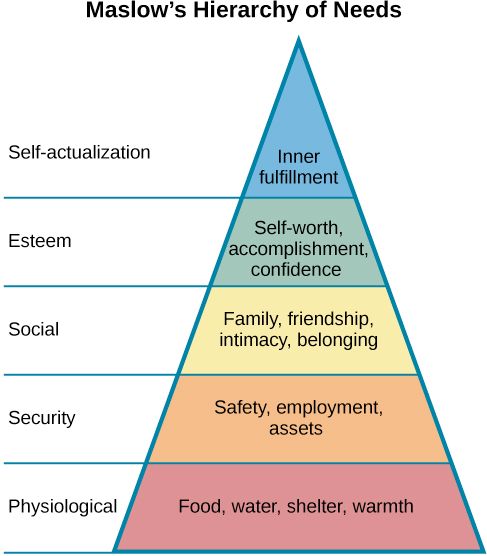

# Abraham Maslow

(1908-1970)

An American psychologist considered one of the most well-known proponents of humanistic psychology

## Subjects

- Humanism
  - Human needs and behaviour motivation

## Achievements

- Hierarchy of human needs in motivating behaviour

