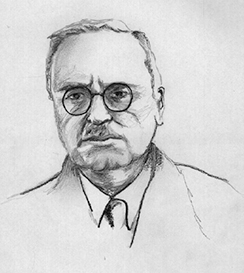

# Alfred Adler

- An Neo-[Freudian](../sigmund-freud)

## Achievements

- The first president of Vienna Psychoanalytical Society
- Founded individual psychology school
- [Birth order theory](birth-order-theory.md)

## Inferiority complex

Refers to a person's feelings that they lack worth and don't measure up to the standards of the others or of society
