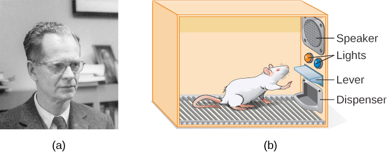

# B. F. Skinner

(1904-1990)

An American psychologist

## Subjects

- [Behaviourism](../john-b-watson/behaviourism.md)
  - Positive and negative reinforcement of learned behaviour

## Achievements

- Skinner box (an operant conditioning chamber)