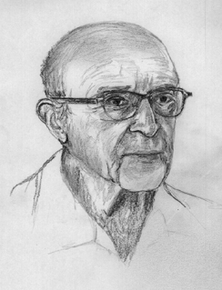

# Carl Rogers

(1902-1987)

An American psychology considered one of the most well-known proponents of humanistic psychology

## Subjects

- Humanism
  - Person-centered therapy (patient-centered therapy)

## Achievements

- Person-centered therapy (patient-centered therapy)

## Video

- [Carl Roger on Person-Centered Therapy](https://www.youtube.com/watch?v=o0neRQzudzw)