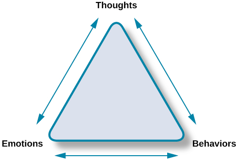

# Clinical Psychology

- Diagnosis and treatment of psychological disorders and problematic behaviour patterns

Counseling psychology focuses on emotional, social, vocational, and health-related outcomes of psychologically healthy individuals.