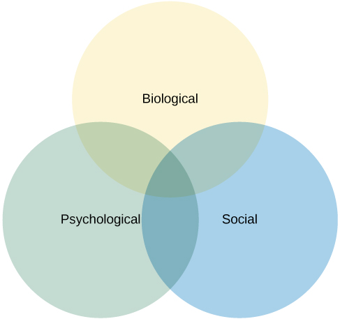

# Health Psychology

Health effects under interactions of biological, psychological, and sociocultural factors

## Objectives

- Better health through public policy, education, intervention, and research

## Subjects

- Relationship between genetic, behaviour patterns, relationships, psychological stress, and health
- Motivate by addressing behaviour patterns causing poorer health

## Biopsychosocial model

