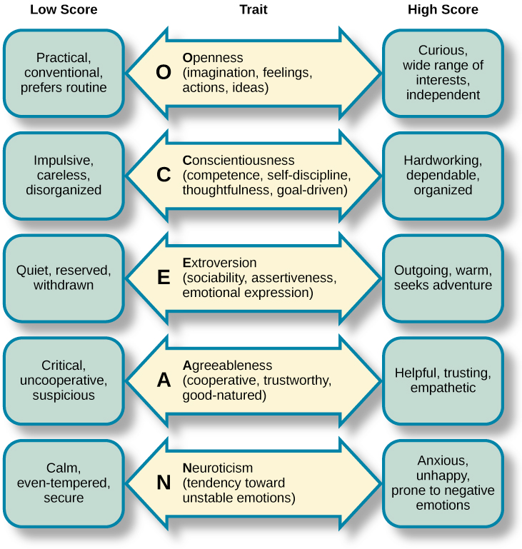

# Personality Psychology

Patterns of thoughts and behaviours making each individual unique

## Subjects

- Personality traits (identifying, measuring)

## Big Five or Five Factor model

- Conscientiousness
- Agreeableness
- Neuroticism
- Openness
- Extraversion

Relatively stable over the lifespan & influenced by genetics

