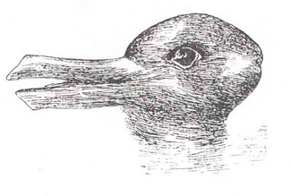

# Sensation & Perception Psychology

Sensation and perception are quite interdisciplinary.

Our experience of our world (perception) is not as simple as the sum total of all of the sensory information (
sensations) together.

Our perception often depends on:

- Attentions
- Previous experiences
- Cultural backgrounds
- ...

## Subjects

- Sights
- Sounds
- Touch sensations
- Smells
- Temperature
- Balance maintenance
- ...

