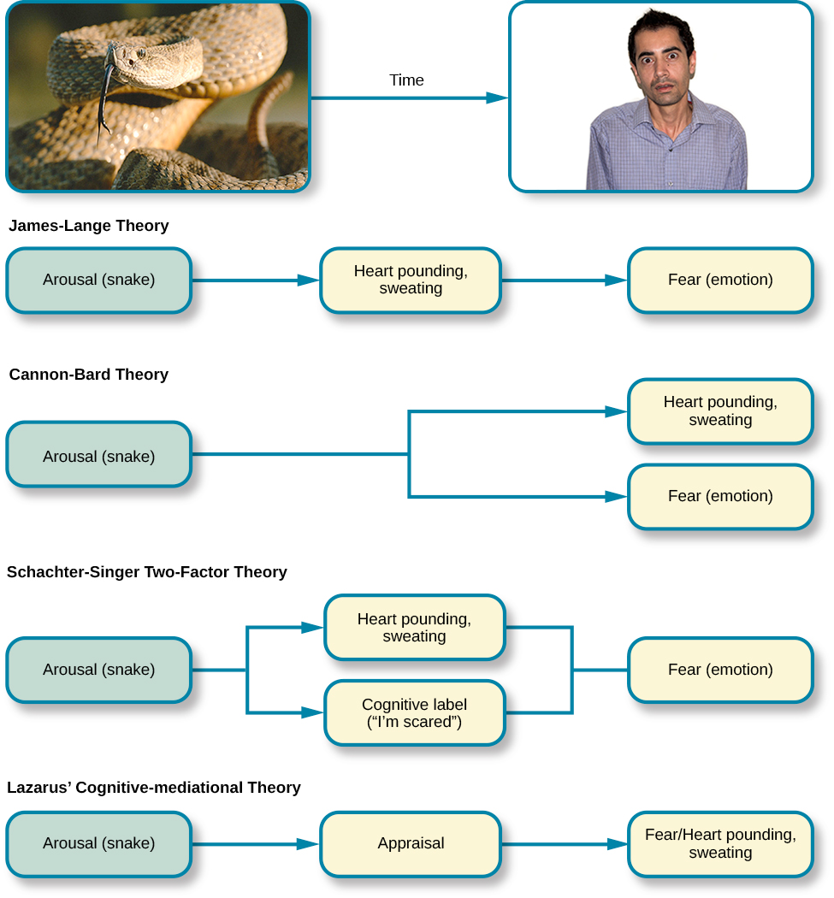
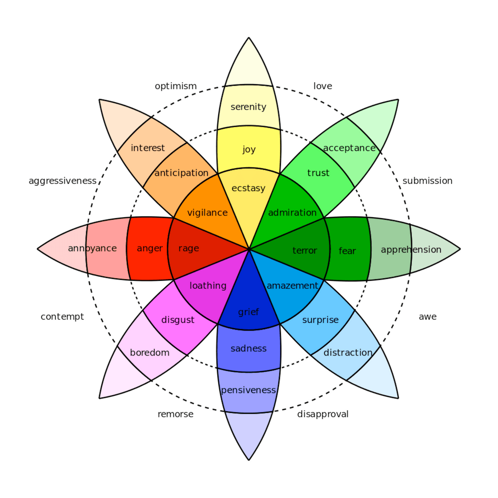
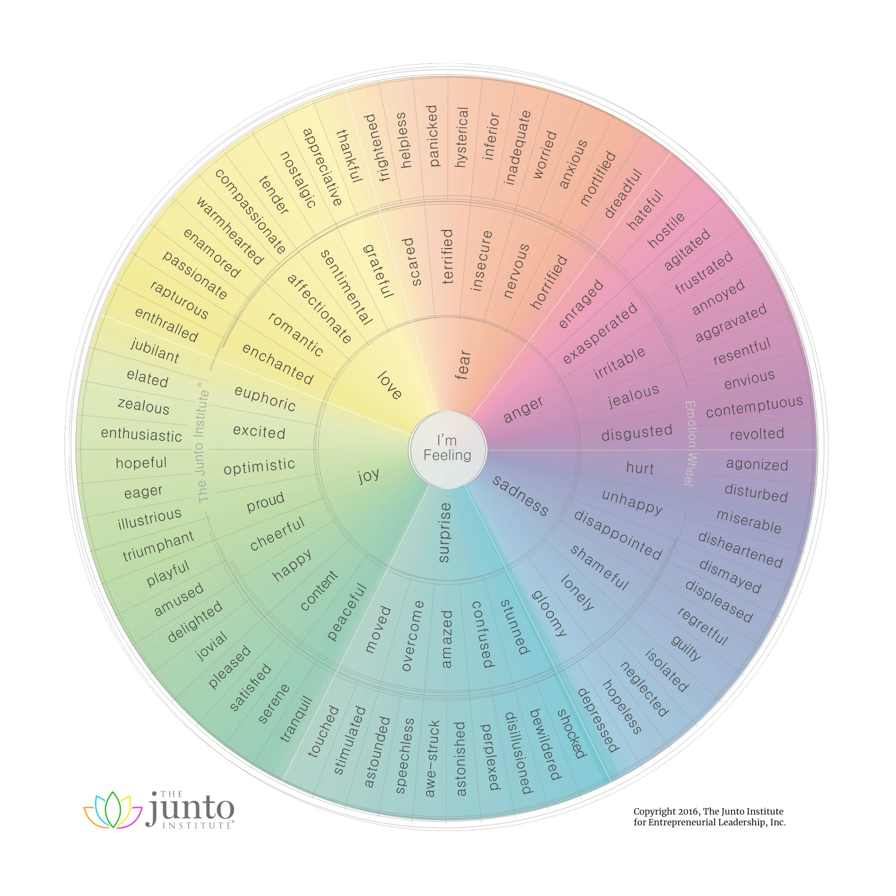

# Emotions

Emotions are energy in motion.

A subjective state of being that we often describe as our feelings.

Emotions result from the combination of subjective experience, expression, cognitive appraisal, and physiological responses.

Often begin with a subjective experience (often an external stimulus)

One expresses his emotions through verbal or nonverbal behaviours.

## Mood

Refers to a prolonged, less intense, affective state that does not occur in response to something we experience.

## Theories of emotion

- [James-Lange theory](theories/james-lange.md)
- [Cannon-Bard theory](theories/cannon-bard.md)
- [Schachter-Singer two-factor theory](theories/schachter-singer.md)
- [Lazarus' cognitive-mediational theory](theories/lazarus.md)

## Plutchick's Model of Emotions

Robert Plutchick (1980)

| Basic emotion | Basic opposite |
|:-------------:|:--------------:|
|      Joy      |    Sadness     |
|     Trust     |    Disgust     |
|     Fear      |     Anger      |
|   Surprise    |  Anticipation  |

| Complex Feeling |      Feelings      |  Opposite   |
|:---------------:|:------------------:|:-----------:|
|    Optimism     |  Anticipation+Joy  | Disapproval |
|      Love       |     Joy+Trust      |   Remorse   |
|   Submission    |     Trust+Fear     |  Contempt   |
|       Awe       |   Fear+Surprise    | Aggression  |
|   Disapproval   |  Surprise+Sadness  |  Optimism   |
|     Remorse     |  Sadness+Disgust   |    Love     |
|    Contempt     |   Disgust+Anger    | Submission  |
| Aggressiveness  | Anger+Anticipation |     Awe     |

## Junto Emotion Wheel

- [Emotional expressions](expressions/README.md)