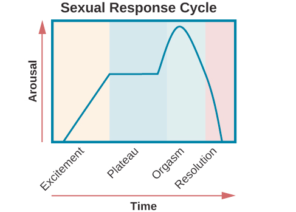

# Sexual Response Cycle

*Masters and Johnson's research*

## Excitement phase

- Erection of penis or clitoris
- Lubrication and expansion of the vaginal canal

## Plateau phase

- Vagina swells further
- Blood flow to the labia minora increases
- Penis becomes fully erect and may exhibit pre-ejaculatory fluid
- Increase muscle tone

## Orgasm phase

- Rhythmic contractions of the pelvis and uterus along with increased muscle tension

## Resolution

- Rapidly return to an unaroused state

## Refractory period

the duration from the last orgasm phase to the next one

- Vary from individual several minutes to a day
- Age influence