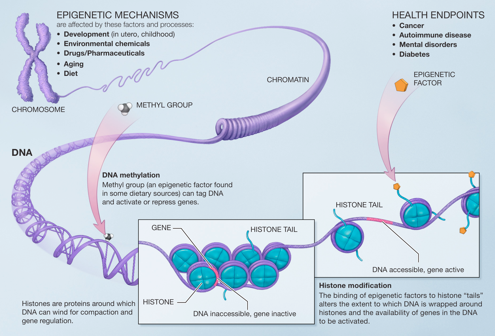

# Genetics

Genetics is a term that refers to the study of genes and their role in inheritance - in other words, the way that certain traits or conditions are passed down from one generation to another.

The result physical characteristics (called the phenotype) are determined by the interaction of genetic material (called the genotype) at first. However, the final expression of individual inherited physical characteristics are influenced by both generic and environment.

## Theories of genes-environment interactions 

- Range of reaction: genes set definite limits on potential, and environment determines how much of that potential is achieved.
- Genetic environment correlation: same as range of reaction + bidirectional interaction
- Epigenetics: how the same (not fixed and limited) genotype (identical twins) can be expressed in different ways

## Gene variations

Allel - a specific version of a gene

- Mutation: a sudden, permanent change in a gene

## References

- Mutation, Repair and Recombination: https://www.ncbi.nlm.nih.gov/books/NBK21114/