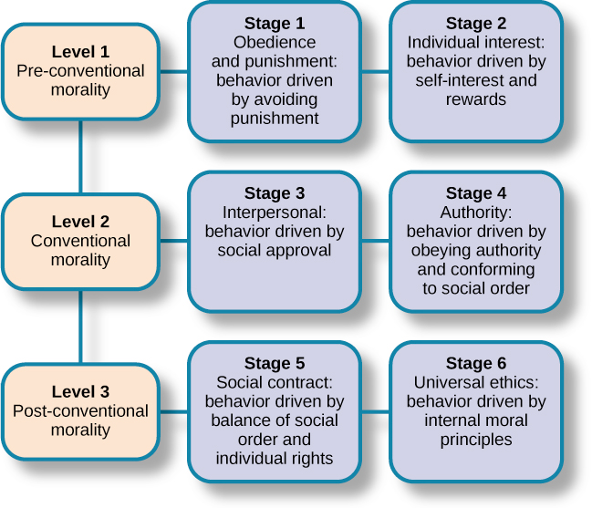

# Moral Theory of Development

Extended from [Cognitive theory](../jean-piaget/cognitive-theory/README.md) of [Jean Piaget](../jean-piaget/README.md)

## Levels and stages of moral reasoning

- Level 1 - Pre-conventional morality
- Level 2 - Conventional morality
- Level 3 - Post-conventional morality

### Level 1 - Pre-conventional morality

- Stage 1: obedience and punishment -> tend to avoid punishment
- Stage 2: individual interests -> tend to self-interest and rewards

### Level 2 - Conventional morality

- Stage 3: interpersonal -> tend to social approval
- Stage 4: authority -> tend to obey authority & conform to social order

### Level 3 - Post-conventional morality

- Stage 5: social contract -> tend to balance between social order & individual rights
- Stage 6: universal ethics -> tend to internal moral principles