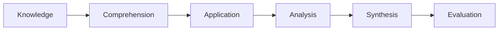
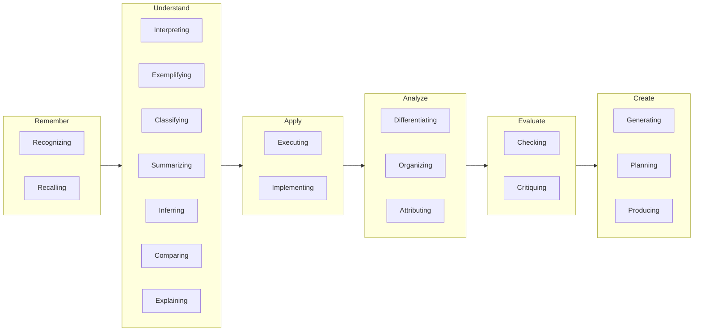

# Educational Goals and Bloom Taxonomy

## Original version

Benjamin Bloom, Max Englehart, Edward Furst, Walter Hill, and David Krathwohl (1956)

## Revised version

(2001)

### Types of knowledge

- Factual
  - Terminology
  - Specific details and elements
- Conceptual
  - Classifications and categories
  - Principles and generalizations
  - Theories, models, and structures
- Procedural
  - Subject-specific skills and algorithms
  - Subject-specific techniques and methods
  - Criteria for determining when to use appropriate procedures
- Metacognitive
  - Strategic
  - Cognitive tasks, including appropriate contextual and conditional
  - Self