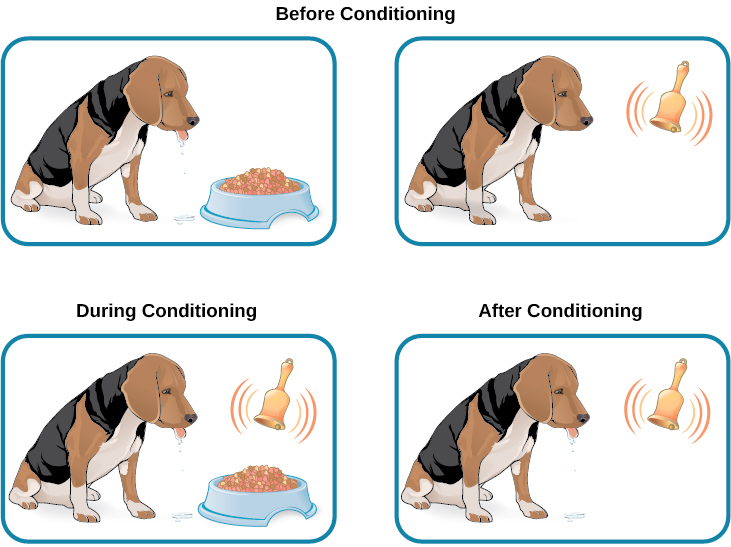

# Classical Conditioning

AKA **Pavlovian Conditioning**

- Associative learning
- Direct experience through daily life

- Unconditioned stimulus (UCS)
- Unconditioned response (UCR)
- Conditioned stimulus (CS)
- Conditioned response (RS)

## General processes

- Acquisition: link CS and UCS; interval between them can be a few seconds up to several hours
- Extinction: decrease CR when UCS doesn't present with CS
- Spontaneous recovery: CR comes back after a delay time

- Stimulus discrimination: learn to respond differently to various stimuli that are similar
- Stimulus generation: trigger CR to stimuli similar the CS