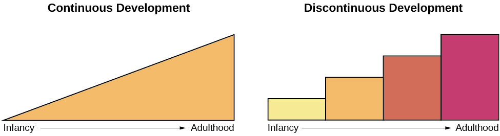

# Major Issues In Development

## Continuous vs. discontinuous developments

### Continuous development

A cumulative process

Gradually improving or changing

### Discontinuous development

Occurring at a specific time

More suddenly

## One vs. many courses of developments

### One course of development

Same, universal for all

### Many courses of development

Different for each

## Nature vs. nurture influences