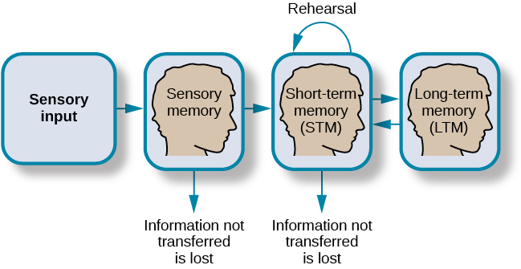

# Atkinson & Shiffrin Model

- Sensory memory
- Short-term memory
- Long-term memory

## Sensory memory

storage of sensory events

up to a couple of seconds

move to short-term if interested, discarded otherwise

## Short-term memory

Processing incoming sensory memory

Often called working memory interchangeably but not precise

15-30 seconds

go to long-term (rehearsal) or discarded

### Rehearsal

- Active rehearsal
- Elaborative rehearsal

#### Active rehearsal

Repeat

#### Elaborative rehearsal

Linking with known information

### Impacts

- Memory trace decay (considered about 18s)
- Proactive interference

