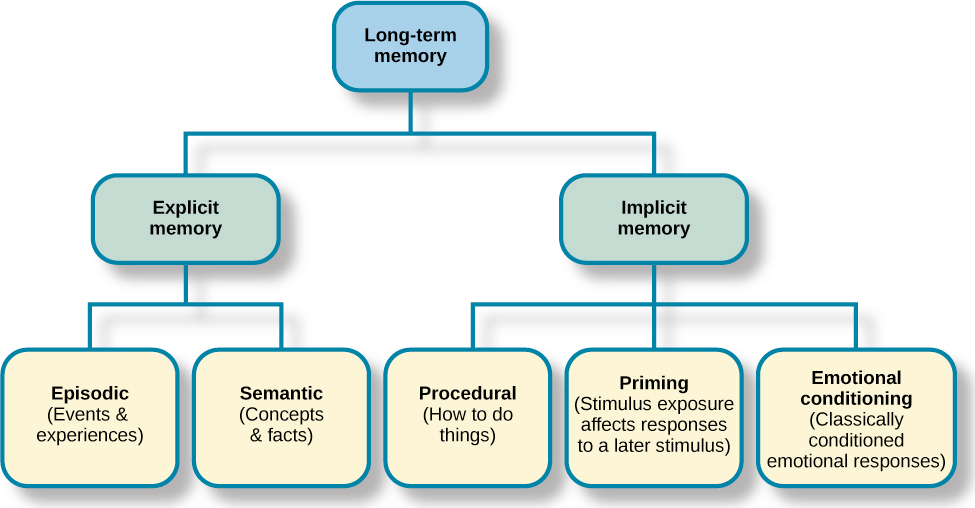

# Long-Term Memory

Believed unlimited

General accepted as a semantic (associative and hierarchical) network of concepts

how often two concepts have been associated is the strength of the link between them

Differ in each person

## Types

- Explicit
- Implicit

### Explicit LTM

consciously stored

- Episodic memory
- Semantic memory

#### Episodic memory

information about events we have personally experienced

#### Semantic memory

knowledge about words, concepts, language-based, and facts

### Implicit LTM

not apart of our consciousness

- Procedural memory
- Priming memory
- Emotional conditioning memory

#### Procedural memory

Information about the way of doing something (skilled actions)

Just do without thinking

#### Priming memory

stimulus exposure affects responses to a later stimulus

#### Emotional conditioning memory

classical conditioned emotion responses

cannot be reported or recalled but can be associated with different stimuli