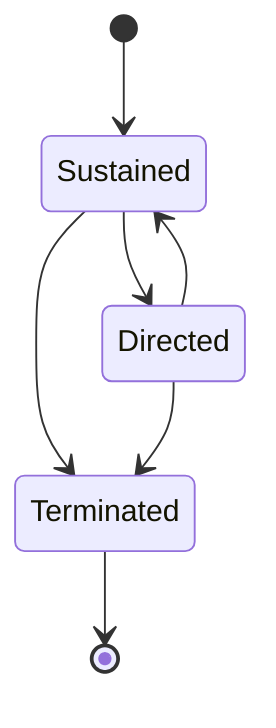

# Motivation

The reasons people behave as they do.

- The choice of behaviour
- The latency of behaviour
- The intensity of behaviour
- The persistence of behaviour
- Cognition and emotional reactions accompanying the behaviour

Theory is better than a set of specific explanations or rules.

Theory is a network of constructs related to each other by a precise set of rules, with some or all of these constructs linked with an operational language.

## Motivation change

- Change the level of adaptivity of an individual cognition
- Change programs that everyone would gain benefits, such as comparing one's own performance