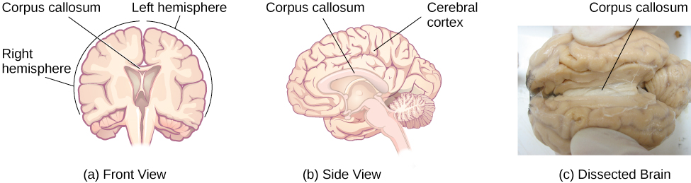

# Nervous System

- The central nervous system (CNS)
- The peripheral nervous system (PNS)

## The peripheral nervous system (PNS)

- Somatic: transfer sensory and motor signal to and from CNS
- Autonomic: control the function of organs and glands
  - Sympathetic division: fight or flight
  - Parasympathetic division: normal functioning under relaxed conditions

CT, PET, MRI, fMRI, and EEG

## Hemispheres

- Left controls right and right controls left
- Left: memory, selective attention, positive emotions
- Right: Pitch perception, arousal, negative emotions

corpus callosum - a thick band (about 200 mils) of neural fibers (axon)