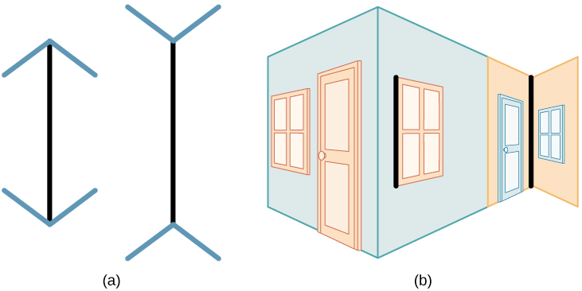

# Perception

Refers to the way sensory information is organised, interpreted, and consciously experienced.

- Bottom-up processing
- Top-down processing
- Influencing factors
- Visual illusions

## Bottom-up processing

Sensory information from a stimulus drives the process

## Top-down processing

Knowledge and expectancy drives the process

## Influencing factors

- Sensory adaption
- Attention: inattentional blinding
- Motivation: signal detection theory
- Beliefs
- Values
- Prejudices
- Expectations
- Experiences

## Visual illusions

