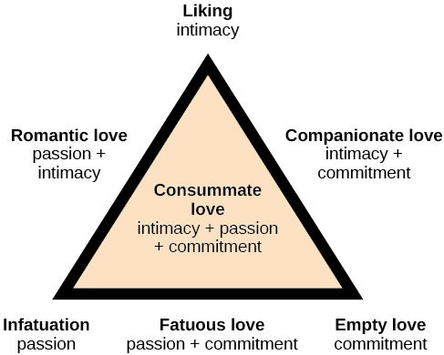

# Sternberg's Triangular Theory of Love

## Intimacy

the sharing of details and intimate thoughts and emotions

## Passion

Physical attraction

## Commitment

standing by

## Consummate love

intimacy + passion + commitment

## Companionate love

intimacy + commitment

close friendships and family relationships

## Fatuous love

passion + commitment

long-term sexual love affair