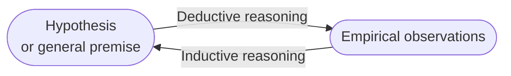
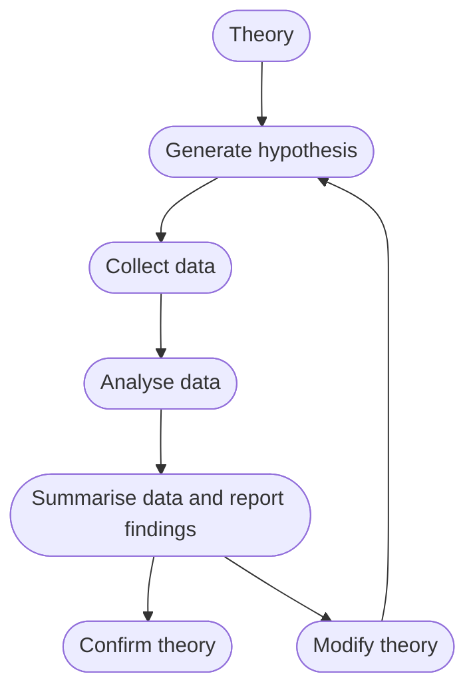

# The Process of Scientific Research

- A theory is a well-developed set of ideas that propose an explanation for observed phenomena.
- A hypothesis is a testable prediction (and thus, falsifiable also) about how the world will behave if our idea is correct, and it is often worded as an if-else statement.
- Deductive reasoning: apply the general principles
- Inductive reasoning: based on observations to make reasonable prediction

