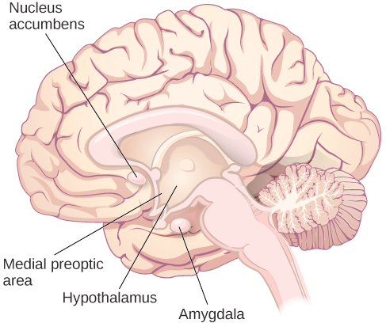

# Sexual Behaviour

The ability to engage to sexual behaviour and sexual motivation are dissociative.

- [Sexual response cycle](response-cycle.md)

## Physiological

- Medial preoptic area: the ability to engage to sexual behaviour
- Nucleus accumbens & amygdala: important for sexual motivation
- Hypothalamus: related to gonads -> affect sexual motivation & sexual behaviour

## Kinsey's research

- Man and women are the same in sex interested and experienced
- Both males and females masturbate without adverse health consequences
- Relationships and sexual acts between people of same gender are fairly common

### Kinsey scale

Categorise one's sexual orientation: emotional, romantic, and erotic attractions to other people and no other.

