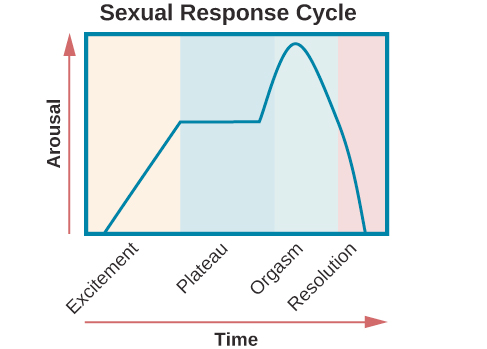

# Sexual Response Cycle

*Masters and Johnson's research*

## Excitement phase

- Erection of penis or clitoris
- Lubrication and expansion of the vaginal canal

## Plateau phase

- Vagina swells further

## Orgasm phase

- Rhythmic contractions of the pelvis and uterus along with increased muscle tension

## Resolution

- Rapidly return to an unaroused state