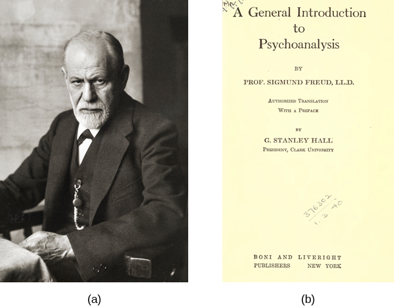

# Sigmund Freud

(1856-1939)

An Austrian neurologist, a medical doctor

- [Psychoanalytic theory](psychoanalytic-theory.md)
- [Psychosexual theory of development](psychosexual-theory/README.md)

## Books

- A General Introduction to Psychoanalysis (1922)