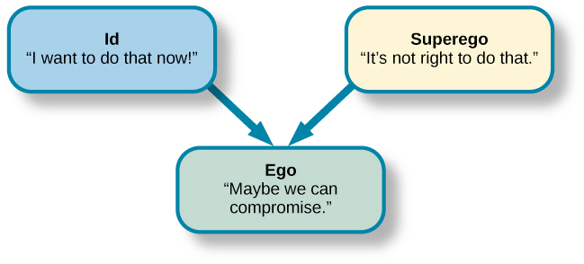

# Freud's Personality Theory

One's personality (ego) develops from a conflict between two forces: biological aggressive and pleasure-seeking drives (id) versus our internal (socialised) control over these drives (superego).

Personality is the result of self's efforts to balance these two competing force.

The ego and superego develops to help control the id.

## Id

The unconscious contains the most primitive drives or urges ("pleasure principles"), and is present from birth.

- Strong -> narcissistic and impulsive

## Superego

The rule-based conscience tells us to behave in socially, religiously acceptable ways.

- Strong -> feelings of guilt and deny
- Weak or absent -> psychopath

## Ego

The self, part of one's personality that others see.

It balances the demands of the id and superego in the context of reality, "reality principle".

Mostly conscious