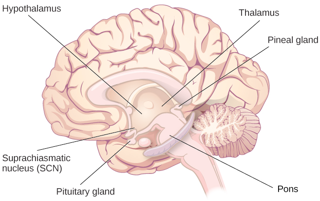

# Sleep

- Thalamus
- Hypothalamus: contains SCN + thalamus to regulate slow-wave sleep
- Pons: regulating REM (Rapid Eye Movement)

- pineal gland releases melatonin
- Melatonin is thought to be involved in the regulation of various biological rhythms and the immune system
- pituitary gland releases 
  - FSH(Follicle Stimulating Hormone) & LH (Luteinizing Hormone) which are important in regulating the reproductive system
  - growth hormone which plays a role in physical growth and maturation as well as other metabolic processes

## Why do we sleep?

Unknown exactly - just benefits of adequate amounts of sleep and risks associated with sleep deprivation

## Benefits

- Important hormones
- Cognitive & memory: learning, attention, making decisions, recall long-term memories

### More

- The connection between memory and sleep: https://www.youtube.com/watch?v=ObuaXhtKbVY

## Problems and disorders

- Insomnia
- Parasomnia: unwanted motor behaviour and experiences -> RBD, sleepwalking, restless leg syndrome, night terrors
- Sleep apnea: stop breathing
- Narcolepsy: 

## Dream

- A state of protoconsciousness (hypothesis)

## Other states of consciousness

- Hypnosis
- Meditation

## References

- https://www.ncbi.nlm.nih.gov/pmc/articles/PMC3389346/
- https://sleepresearchsociety.org/publications/white-papers/
- https://www.apa.org/news/press/releases/2023/12/sleep-deprivation-anxious
- https://www.apa.org/pubs/search?query=sleep+deprivation&Classification=Sleep&sort=Relevance
- https://www.prisma-statement.org/
- https://www.mdpi.com/2227-9032/7/1/1