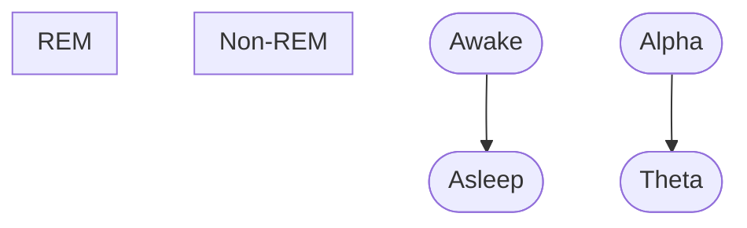
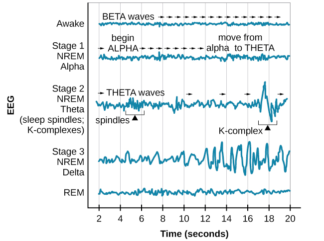
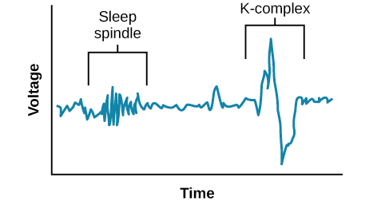

# Stages of Sleep

Based on the patterns of brain wave activity

- Awake: beta waves (high frequency 13-30Hz and low amplitude)
- REM (Rapid Eye Movement): likely awake stage
- Non-REM: has three sub-stages

## Non-REM stages

- Stage 1: slow down the rates of respiration & heartbeat, muscle tension, core body temperature; alpha (8-12Hz & +amplitude) + theta (4-7Hz & ++amplitude) waves; not feel asleep if awaken
- Stage 2: deep relaxation
  - Sleep spindles: important for learning and memory
  - K-complex: high amplitude, respond to environmental stimuli
- Stage 3: deep sleep (slow-wave), delta wave (< 3Hz & +++amplitude), dramatically slow heartbeat & respiration rates, hard to be waken

## REM stage

- Similar awake brain wave
- Dreaming occurs
- Referred to paradoxical sleep: awake brain wave but lack of muscle tone
- Implicated homeostasis and in various aspects of learning and memory, emotional processing and regulating 

### REM rebound

Spend more time in REM stage after REM deprivation