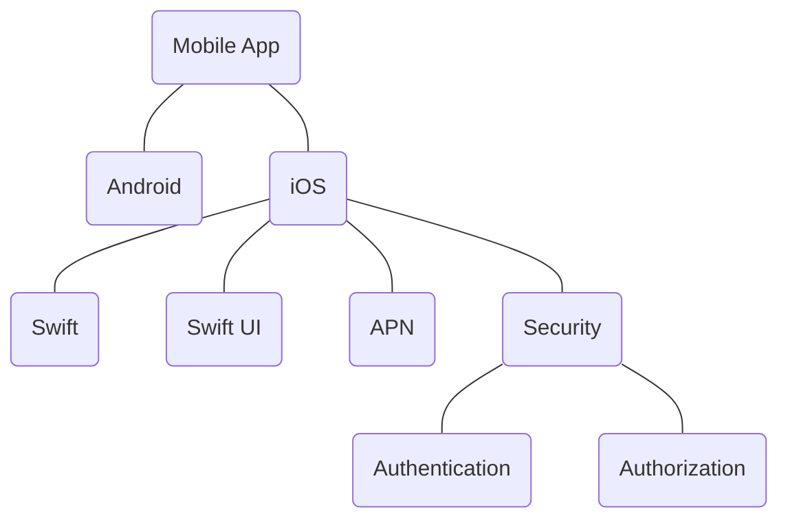

# SMART Goals

- Specific: an observable action or behaviour
- Measurable: The end result in qualitative or quantitative
- Attainable (Achievable):
- Relevant: resources, other things
- Time-framed: deadlines

## Check list

- What action do I need to take? What is the specific action to be taken in order to achieve the goal?
- To what extent is the action to be taken? How often? How much? When? With whom?
- For what results? What impact will achieving the goal have in relation to other your short-term and long-term goals?

## Guidelines

- Specific: clearly stated? performed functions?
- Measurable: quantifiable, scopes?, observable results?
- Attainable: required experience? skills? knowledge? resources?
- Relevant: 
- Time-framed: completion date, duration, frequency

## Examples

