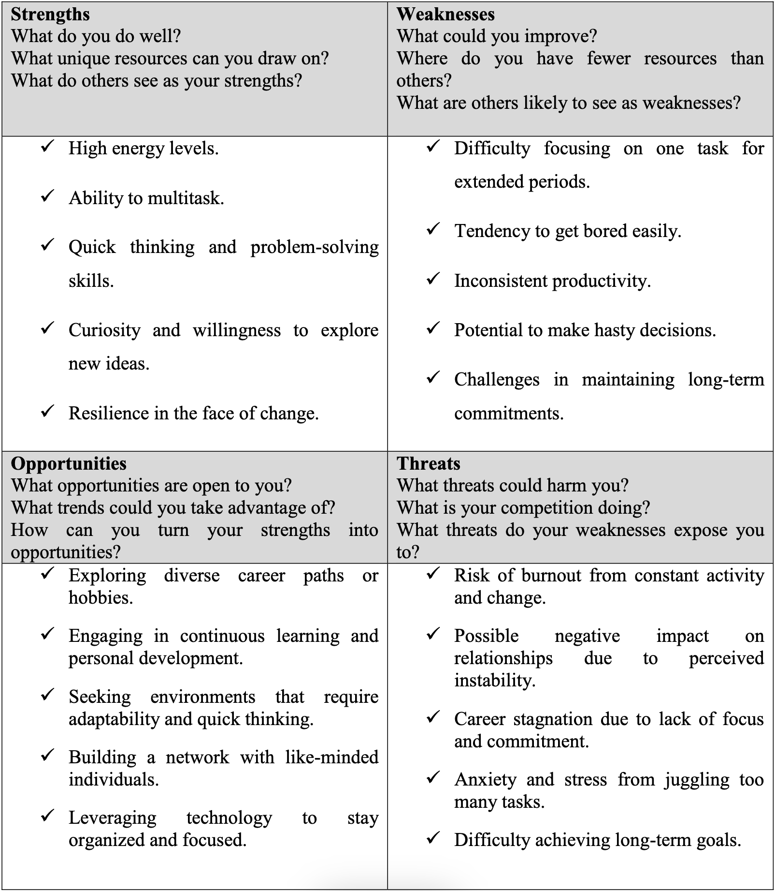

# Sample 02 - Restlessness

## What I’ve learned from analyzing my Strengths

Reflecting on my strengths, I realize that my high energy levels and curiosity drive me to explore
various interests and ideas. This trait has allowed me to develop a broad skill set and adapt
quickly to new environments. My resilience ensures that I can handle changes and challenges
effectively. Recognizing these strengths, I can leverage them to pursue diverse opportunities and
continuously grow both personally and professionally.

## What I’ve learned from analyzing my Weaknesses

Acknowledging my weaknesses, I see that my restlessness often leads to difficulty focusing and
inconsistent productivity. This lack of focus can result in unfinished projects and hasty decisions.
Understanding these weaknesses allows me to develop strategies to mitigate them, such as
breaking tasks into smaller, manageable parts and practicing mindfulness to improve
concentration.

## What I’ve learned from analyzing my Opportunities

By identifying opportunities, I see the potential to channel my restlessness into positive avenues.
Engaging in continuous learning and exploring different career paths can provide the variety I
crave. Building a network with others who thrive on change can offer support and inspiration.
Additionally, utilizing technology can help me stay organized and make the most of my diverse
interests.

## What I’ve learned from analyzing my Threats

Recognizing threats, I understand the risk of burnout and the potential negative impact on my
relationships and career. Juggling too many tasks can lead to anxiety and stress, hindering my
ability to achieve long-term goals. By being aware of these threats, I can take proactive steps to
manage my restlessness, such as setting realistic goals, prioritizing self-care, and seeking balance
in my activities.

## What I’ve learned from doing this analysis?

Completing this SWOT analysis has provided me with valuable insights into my restlessness. I
have learned to recognize and appreciate the strengths that come with it, as well as to
acknowledge and address the weaknesses. By understanding the opportunities and threats, I can
take proactive steps to channel my restlessness positively and mitigate its negative impacts.

## How I might use this information going forward?

Going forward, I will use this information to create a balanced approach to managing my
restlessness. I plan to leverage my strengths and opportunities by seeking out new experiences
and continuously learning while addressing my weaknesses through better focus and time
management strategies. I will also be mindful of the threats and take steps to prevent burnout and
maintain my health and relationships. This analysis has empowered me to view my restlessness
in a more constructive light and use it to drive personal and professional growth.

In conclusion, through this SWOT analysis, I have gained a deeper understanding of how
restlessness affects various aspects of my life. While it brings energy and adaptability, it also
poses challenges in maintaining focus and stability. Moving forward, I plan to harness my
strengths and opportunities to create a dynamic and fulfilling life, while actively addressing my
weaknesses and threats to ensure sustainable growth and well-being. This balanced approach will
help me use my restlessness as a catalyst for positive change rather than a source of instability