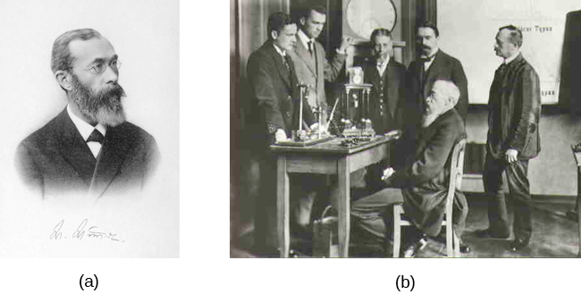

# Wilhelm Wundt

1832-1920

A German scientist considered as the first psychologist and credited as one of the founders of psychology.

## Achievements

- [Axes of personality traits](personality-traits-axes.md)

## Books

- Principles of Physiological Psychology (1873)
- Volkerpsychologie (1904)

## Students

- Edward Titchener